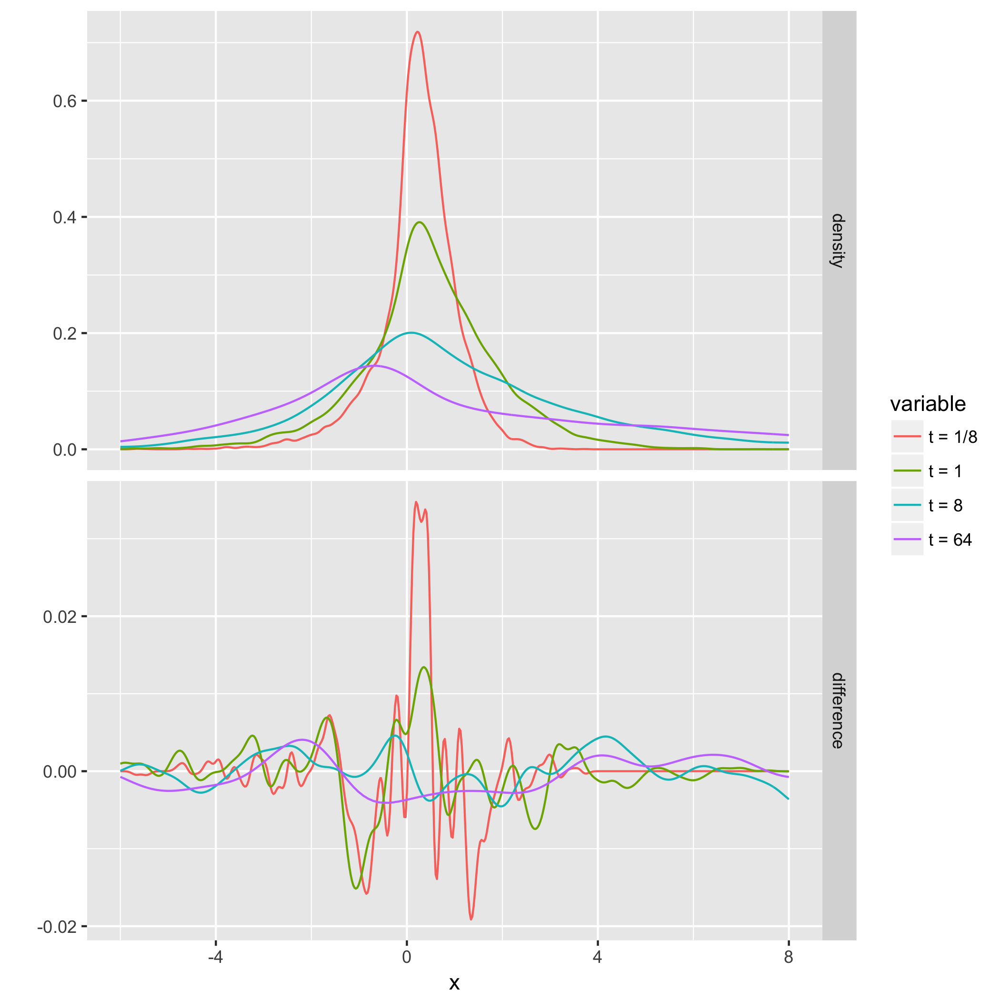
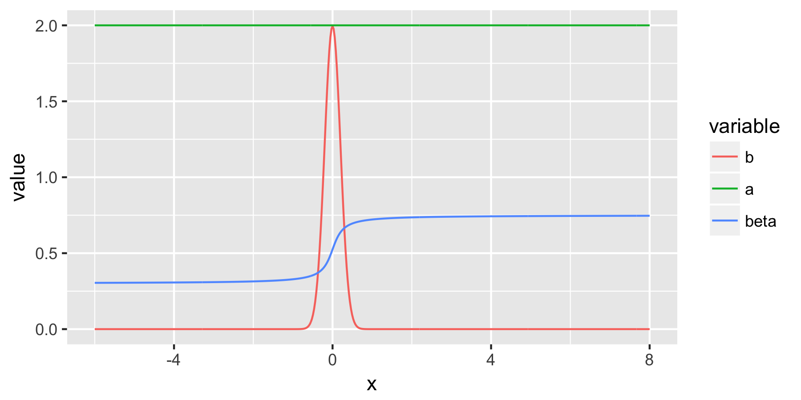

Also see: 

* My [Blogpost](https://strakaps.github.io/post/voffpe/) with a 
  one page introduction to fractional diffusion
* The pdf version of the article, available [here](/varyKern.pdf) 
  and on the [arXiv](https://arxiv.org/abs/1712.06767)
* The published paper at [Physica A](https://doi.org/10.1016/j.physa.2018.03.010)


## Simulation of trajectories for variable order fractional diffusion

The paper derives a "Variable Order Fractional Fokker-Planck Equation", 
which has the strange property that a global change in the time-scale 
(e.g. measure time in minutes instead of seconds) induces locally 
different changes in the dynamics. 
To check that the equation is consistent, we calculate (an approximation 
of) the solution at two different time scales, $T_0 = 1$ and $T_0 = 10$. 


## Helper functions

The inverse tail function of the waiting times:

```{r}
invTailPsi <- function(q, beta = 0.7, theta = 0, c=1){
    (gamma(1-beta) * c * q)^(-1/beta)
}
```

Waiting times are simulated via [inverse transform sampling](https://en.wikipedia.org/wiki/Inverse_transform_sampling): 

```{r}
drawT <- function(x) invTailPsi(q = runif(1), beta = beta(x), c = c)
```

Given drift and diffusivity functions $a(x)$ and $b(x)$, jumps are simulated 
via 

```{r}
drawJ <-
    function(x) {
    rnorm(
    n = 1,
    mean = b(x) / (timescale ^ beta(x) * c),
    sd = sqrt(a(x) / (timescale ^ beta(x) * c))
    )
    }
```

Given a vector of times `endTimes` (e.g. `r 2^(-3:3)`), this function returns the location 
of one CTRW trajectory at these times (first column) and the number of steps taken in the time interval $(0, \text{endTime})$ (second column). 

```{r}
propagateCTRW <- function(startLocation, endTimes){
    steps <- 0
    endTimes <- sort(endTimes)
    endLocations <- numeric(0)
    endSteps <- numeric(0)
    t <- 0
    x <- startLocation
    t <- t + drawT(x)
    for (tEnd in endTimes){
        while(t < tEnd){
            x <- x + drawJ(x)
            t <- t + drawT(x)
            steps <- steps + 1
        }
        endLocations <- c(endLocations, x)
        endSteps <- c(endSteps, steps)
    }
    return(cbind(endLocations, endSteps))
}
```


## Global parameters

```{r}
library(parallel)
library(plyr)
library(magrittr)
beta <- function(x) 0.525 + 0.45 * atan(x/0.2)/pi
a <- function(x) 2
b <- function(x) dnorm(x, 0, 0.2)
c <- 200
tEnd <- 2^(c(-3, 0, 3, 6))
# initialize the arrays storing the output of propagateCTRW
ensemble1 <- array(dim=c(0,length(tEnd),2))
ensemble2 <- array(dim=c(0,length(tEnd),2))
num_trajectories <- 10000
```

## At scale $T_0 = 1$

This block generates a number of trajectories and appends their values 
to `ensemble1`. Run it multiple times if more trajectories are needed. 

```{r, eval=FALSE}
timescale <- 1
startX <- 0

more <- mclapply(X = rep(startX, num_trajectories), 
         FUN = function(x) propagateCTRW(startLocation = startX, 
                                         endTimes = tEnd * timescale), 
         mc.cores = detectCores())
more <- laply(.data = more, .fun = function(slice) slice)

ensemble1 <- abind::abind(ensemble1, more, along=1)

if (mean(ensemble1[,1,2]) < 30) print("Careful: not enough steps. Increase c.")
```


## At scale $T_0 = 10$

Identical to the above block. Run multiple times if more trajectories needed. 

```{r, eval=FALSE}
timescale <- 10
startX <- 0

more <- mclapply(X = rep(startX, num_trajectories), 
         FUN = function(x) propagateCTRW(startLocation = startX, 
                                         endTimes = tEnd * timescale), 
         mc.cores = detectCores())
more <- laply(.data = more, .fun = function(slice) slice)

ensemble2 <- abind::abind(ensemble2, more, along=1)
if (mean(ensemble2[, 1, 2]) < 30)
    print("Careful: not enough steps. Increase c."
    )
```


## Comparing the densities

`ensemble1` and `ensemble2` contain the positions of the walkers at 
the times `r tEnd` and `r 10 * tEnd`.  Apply the kernel density estimator 
`density()` from the `stats` package and plot 

1. the density of `ensemble1` and 
2. the difference `ensemble2 - ensemble1`:


```{r plot-densities-ggplot2, eval=FALSE}
library(tidyverse)

from = -6
to = 8
n = 512

ensemble_to_matrix <- function(ensemble) {
    d <- density(ensemble, from = from, to = to, n = n)
    d$y
}
y1 <- apply(ensemble1[ , ,1], 2, ensemble_to_matrix) %>% as.data.frame()
names(y1) <- c("t = 1/8", "t = 1", "t = 8", "t = 64")
y2 <- apply(ensemble2[ , ,1], 2, ensemble_to_matrix) %>% as.data.frame()
names(y2) <- names(y1)
x <- density(ensemble1[,1,1], from = from, to = to, n = n)$x
density_df <- cbind(x, y1)
density_df$panel <- "density"
diff_df <- cbind(x, y2-y1)
diff_df$panel <- "difference"

p_dens <- rbind(density_df, diff_df) %>%
    reshape2::melt(c("x", "panel")) %>%
    ggplot(aes(x = x, y = value, colour = variable)) + 
    geom_line()  + ylab("") + 
    facet_grid(panel ~ ., scales = "free")
```

```{r save-plots, eval=FALSE, include=FALSE}
library(ggplot2)
ggsave(filename = "densities.pdf", plot = p_dens)
ggsave(filename = "densities.png", plot = p_dens)
```



And this is what the coefficients look like: 

```{r, include=FALSE, eval=FALSE}
ggsave(filename = "beta_b.pdf", plot = p_coef, width = 6, height = 3)
ggsave(filename = "beta_b.png", plot = p_coef, width = 6, height = 3)
```


```{r coefficients-plot, eval=FALSE}
p_coef <- tibble(x = x, b = b(x), a = a(x), beta = beta(x)) %>%
    reshape2::melt("x") %>%
    ggplot(aes(x = x, y = value, colour = variable)) + geom_line()
```


