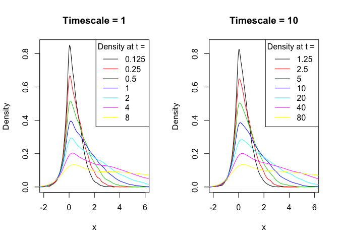

Simulation of trajectories for variable order fractional diffusion
================

Helper functions
----------------

The inverse tail function of the waiting times:

``` r
invTailPsi <- function(q, beta = 0.7, theta = 0, c=1){
    (gamma(1-beta) * c * q)^(-1/beta)
}
```

Waiting times are simulated via [inverse transform sampling](https://en.wikipedia.org/wiki/Inverse_transform_sampling):

``` r
drawT <- function(x) invTailPsi(q = runif(1), beta = beta(x), c = c)
```

Given drift and diffusivity functions *a*(*x*) and *b*(*x*), jumps are simulated via

``` r
drawJ <- function(x) rnorm(n = 1, mean = b(x)/c, sd = sqrt(a(x)/c))
```

Given a vector of times `endTimes`, this function returns the location of one CTRW trajectory at these times (first column) and the number of steps taken in the time interval (0, endTime).

``` r
propagateCTRW <- function(startLocation, endTimes){
    steps <- 0
    endTimes <- sort(endTimes)
    endLocations <- numeric(0)
    endSteps <- numeric(0)
    t <- 0
    x <- startLocation
    t <- t + drawT(x)
    for (tEnd in endTimes){
        while(t < tEnd){
            x <- x + drawJ(x)
            t <- t + drawT(x)
            steps <- steps + 1
        }
        endLocations <- c(endLocations, x)
        endSteps <- c(endSteps, steps)
    }
    return(cbind(endLocations, endSteps))
}
```

Global parameters
-----------------

``` r
library(parallel)
library(plyr)
library(magrittr)
beta <- function(x) 0.525 + 0.45 * atan(x)/pi
c <- 200
tEnd <- 2^(-3:3)
# initialize the arrays storing the output of propagateCTRW
ensemble1 <- array(dim=c(0,length(tEnd),2))
ensemble2 <- array(dim=c(0,length(tEnd),2))
```

At scale *T*<sub>0</sub> = 1
----------------------------

This block generates a number of trajectories and appends their values to `ensemble1`. Run it multiple times if more trajectories are needed.

``` r
timescale <- 1
startX <- 0
a <- function(x) timescale^(-beta(x))
b <- function(x) timescale^(-beta(x))

num_trajectories <- 15000
more <- mclapply(X = rep(startX, num_trajectories), 
         FUN = function(x) propagateCTRW(startLocation = startX, 
                                         endTimes = tEnd * timescale), 
         mc.cores = detectCores())
more <- laply(.data = more, .fun = function(slice) slice)

ensemble1 <- abind::abind(ensemble1, more, along=1)

if (mean(ensemble1[,1,2]) < 30) print("Careful: not enough steps. Increase c.")
```

At scale *T*<sub>0</sub> = 10
-----------------------------

Identical to the above block. Run multiple times if more trajectories needed.

``` r
timescale <- 10
startX <- 0
a <- function(x) timescale^(-beta(x))
b <- function(x) timescale^(-beta(x))

num_trajectories <- 15000
more <- mclapply(X = rep(startX, num_trajectories), 
         FUN = function(x) propagateCTRW(startLocation = startX, 
                                         endTimes = tEnd * timescale), 
         mc.cores = detectCores())
more <- laply(.data = more, .fun = function(slice) slice)

ensemble2 <- abind::abind(ensemble2, more, along=1)
if (mean(ensemble2[,1,2]) < 30) print("Careful: not enough steps. Increase c.")
```

Comparing the densities
-----------------------

`ensemble1` and `ensemble2` contain the positions of the walkers at the times 0.125, 0.25, 0.5, 1, 2, 4, 8 and 1.25, 2.5, 5, 10, 20, 40, 80. Apply the kernel density estimator `density()` from the `stats` package and plot the densities:


